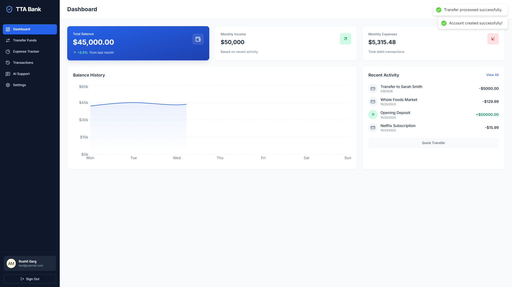
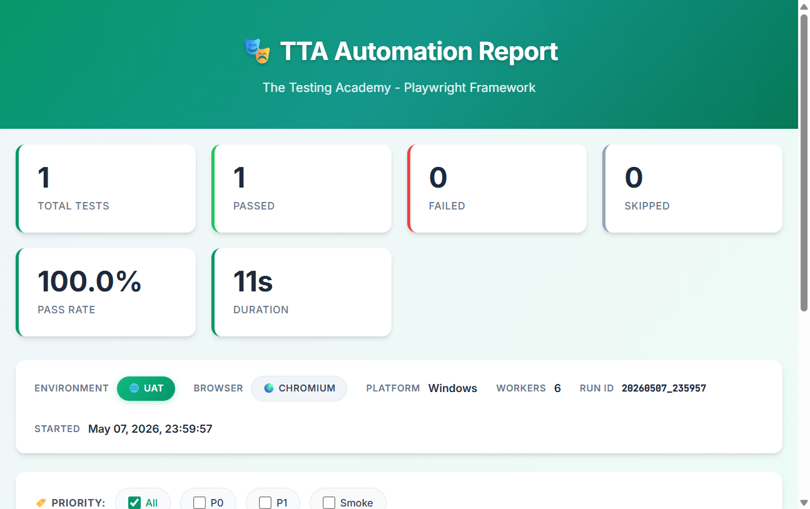

# Task 02 May 2026 - TTA Bank Digital Automation

This directory contains the Playwright automation script for the TTA Bank Digital application.

## Objective
Automate the following flow on the TTA Bank Digital application:
1. Navigate to the application URL.
2. Sign up with valid credentials.
3. Verify the initial balance is $50,000.00.
4. Transfer $5,000 to another account.
5. Verify the updated balance is $45,000.00.

## Step-by-Step Execution and Code

Here is the complete code used for this automation, explaining each step in detail:

```typescript
import { test, expect } from "@playwright/test";

test("toautomateTTA_Bank", async ({ page }) => {
    // Step 1: Navigate to the Application
    console.log("🌐 Navigating to TTA Bank Digital app...");
    await page.goto("https://tta-bank-digital-973242068062.us-west1.run.app/");

    // Step 2: Navigate to the Sign Up page
    console.log("🖱️  Clicking Sign Up button...");
    await page.getByRole('button', { name: 'Sign Up' }).click();

    // Step 3: Fill out the Registration Form
    console.log("✍️  Filling registration form - Name: Rushil Garg, Email: test@yopmail.com");
    await page.locator('[type="text"]').fill('Rushil Garg');
    await page.locator('[type="email"]').fill('test@yopmail.com');
    await page.locator('[type="password"]').fill('Test@1234');

    // Step 4: Submit the form to create an account
    console.log("🚀 Submitting Create Account form...");
    await page.getByRole('button', { name: 'Create Account' }).click();

    // Step 5: Verify the initial account balance
    console.log("✅ Verifying initial balance is $50,000.00...");
    await expect(page.getByRole("heading", { name: "$50,000.00" })).toBeVisible();

    // Step 6: Initiate a fund transfer
    console.log("💸 Initiating fund transfer of $5,000...");
    await page.getByRole('button', { name: 'Transfer Funds' }).click();
    await page.locator('[type="number"]').fill('5000');
    await page.getByRole('button', { name: 'Continue' }).click();
    await page.getByRole('button', { name: 'Confirm Transfer' }).click();

    // Step 7: Return to Dashboard
    console.log("🏠 Navigating back to Dashboard...");
    await page.getByRole('button', { name: 'Dashboard' }).click();

    // Step 8: Verify the updated balance reflects the transfer
    console.log("✅ Verifying updated balance is $45,000.00...");
    await expect(page.getByRole("heading", { name: "$45,000.00" })).toBeVisible();
    await expect(page.getByRole("main")).toContainText("$45,000.00");

    console.log("🎉 Test completed successfully! Balance updated from $50,000.00 → $45,000.00");
});
```

## Test Verification

The test has been successfully executed. We have verified both the application state and the custom reporter output. 

### 1. Application Screenshot
Below is the screenshot captured at the end of the test execution, verifying that the final balance is successfully updated to `$45,000.00` after the transfer:



### 2. Custom Reporter Verification
The test execution generates a custom TTA HTML Report displaying the real-time execution status, passed/failed metrics, and detailed step-by-step logs. 

Below is the screenshot of the Custom TTA Reporter output generated for this test run:



## Commands to Run
To execute the test and generate the custom report, use the following command from the root of the project:

```bash
npx playwright test tests/Daily_Projects/Task_02May2026/Task_02May2026.spec.ts
```

The custom report will be saved inside the `tta-report` directory at the project root.
